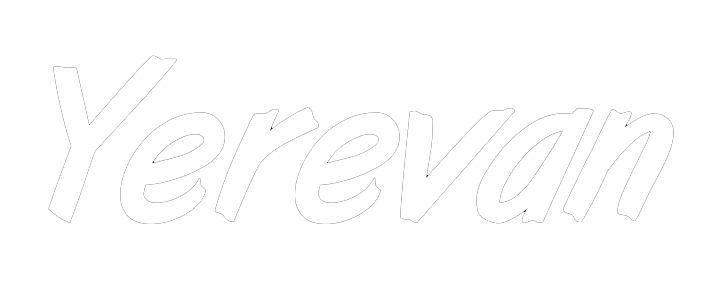
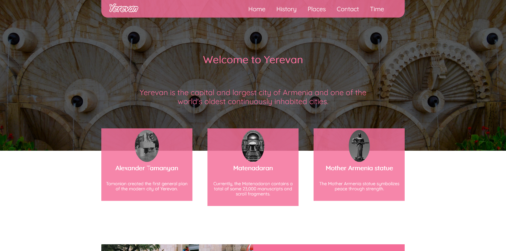
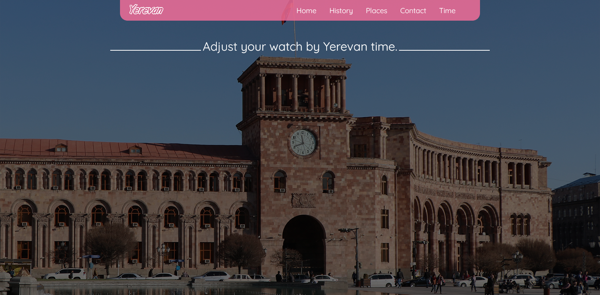

  

 <h3 align="center">Interesting project about Yerevan</h3>

## About The Project

Working clock inside project

### Built With

This project was prepared to present Yerevan to the public.

Were used to prepare the project

- html
- css
- little pure js

<!-- GETTING STARTED -->

## Getting Started

Our team will welcome you by opening the first page of the project․
In the pages you will find the most interesting and important facts about Yerevan․

## License

Distributed under the MIT License.
